<!-- HARSH PATIL - GITHUB PROFILE -->

<div align="center">

<!-- GLITCH NAME ANIMATION -->


<br/>

<!-- BOOT SEQUENCE - plays once -->


<br/>

<!-- LOOPING TYPING ANIMATION -->


<br/><br/>

[](https://github.com/HarshPatil30)


<br/><br/>


</div>

<br/>

### `HarshPatil30@github ~ $ ./contributions.sh`

<div align="center">

</div>

<br/>


### `HarshPatil30@github ~ $ whoami`

<table width="100%" border="0" cellspacing="16" cellpadding="0">
<tr>
<td width="43%" valign="top">

</td>
<td width="57%" valign="top">

</td>
</tr>
</table>

<br/>

<div align="center">


<br/><br/>

## `[ FEATURED PROJECTS ]`


</div>

<br/>

<table width="100%" border="0" cellspacing="20" cellpadding="0">
<tr>
<td width="50%" valign="top">

```
╔════════════════════════════════════════╗
║  PROJECT  ::  EcoGame                  ║
╠════════════════════════════════════════╣
║                                        ║
║  STACK    ::  JavaScript               ║
║  TYPE     ::  EdTech · Game            ║
║                                        ║
║  Mini-games teaching kids to           ║
║  recycle, save energy & protect        ║
║  the environment. Learn by playing.    ║
║                                        ║
╚════════════════════════════════════════╝
```
[→ View Repository](https://github.com/HarshPatil30/EcoGame)

</td>
<td width="50%" valign="top">

```
╔════════════════════════════════════════╗
║  PROJECT  ::  ML Text Summarizer       ║
╠════════════════════════════════════════╣
║                                        ║
║  STACK    ::  Python · LSTM · NLP      ║
║  TYPE     ::  ML · Deep Learning       ║
║                                        ║
║  Context-aware text summarization      ║
║  using Seq2Seq LSTM networks.          ║
║  Understands what matters most.        ║
║                                        ║
╚════════════════════════════════════════╝
```
[→ View Repository](https://github.com/HarshPatil30/ML-project)

</td>
</tr>
<tr>
<td width="50%" valign="top">

```
╔════════════════════════════════════════╗
║  PROJECT  ::  Library Management       ║
╠════════════════════════════════════════╣
║                                        ║
║  STACK    ::  HTML · JavaScript        ║
║  TYPE     ::  Web · Management         ║
║                                        ║
║  Book records, member tracking         ║
║  and transaction management            ║
║  system. Clean and functional.         ║
║                                        ║
╚════════════════════════════════════════╝
```
[→ View Repository](https://github.com/HarshPatil30/library-management-system)

</td>
<td width="50%" valign="top">

```
╔════════════════════════════════════════╗
║  PROJECT  ::  NGO Volunteer App        ║
╠════════════════════════════════════════╣
║                                        ║
║  STACK    ::  React · Tailwind         ║
║  TYPE     ::  Full Stack · Social      ║
║                                        ║
║  Full-stack platform for NGO           ║
║  volunteer management, events          ║
║  and admin dashboards.                 ║
║                                        ║
╚════════════════════════════════════════╝
```
[→ View Repository](https://github.com/Sanjana-Chinnannavar/ngo-app)

</td>
</tr>
</table>

<br/>

<div align="center">


<br/><br/>

## `[ TECH ARSENAL ]`


<br/><br/>

**LANGUAGES**


<br/>

**ML / DATA**


<br/>

**FRAMEWORKS**


<br/>

**TOOLS & PLATFORMS**


<br/><br/>


<br/><br/>

## `[ CONTRIBUTION SNAKE ]`


<br/><br/>


<br/><br/>


<br/><br/>

## `[ ESTABLISH CONNECTION ]`


<br/><br/>

[](https://www.linkedin.com/in/harshpatil3006)
[](https://github.com/HarshPatil30)
[](mailto:patilharsh3006@gmail.com)

<br/><br/>

```
> session.end()
  — thanks for visiting. now go build something. —
```

<br/>


</div>
